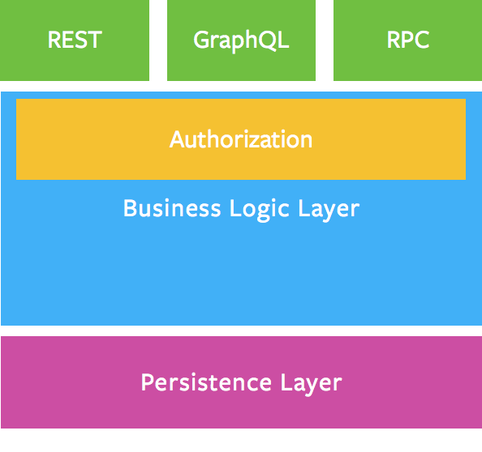

# 后端接口

Express + GraphQL + Mongoose

GraphQL 服务器使用开源的 Apollo Server 库。它可与许多 Node.js HTTP 服务器框架配合使用。Apollo Server 是目前使任何来源的数据快速构建为 GraphQL API 的最佳方式。

本项目考虑将 Apollo Server 与 Express 做集成，apollo-server 库换成 apollo-server-express 库。

未来后端接口形式有两种:

- Restful API

用于未来与第三方系统做接口对接使用此类接口

- GraphQL API

用于本平台相关的业务接口

## 项目结构

- api 文件夹

所有接口开发都放在这个文件夹中，里面包括 graphql 文件夹和 rest 文件夹，分别存放不同类型的接口代码。

- service 文件夹

所有的业务逻辑层代码

- model 文件夹

所有的数据处理层代码

## 技术栈

### GraphQL

FackBook 在 2012 年 开发的一个开源 API 接口，为的是在 native mobile app 中应用。后来，在 2015 年的 React 大会上，FB 宣称开源 GraphQL 项目。它与 React.js 的完美搭配，属于描述性查询语言，查询方便理解，提供了一套易于理解的完整描述。

从官方的定义来说，GraphQL 是一种针对 API 的查询语言；在我看来，GraphQL 是一种标准，而与标准相对的便是实现。就像 EcmaScript 与 JavaScript 的关系，从一开始你就需要有这样一种认知：GraphQL 只定义了这种查询语言语法如何、具体的语句如何执行等。但是，你在真正使用某种 GraphQL 的服务端实现时，是有可能发现 GraphQL 标准中所描述的特性尚未被实现；或者这种 GraphQL 的实现扩展了 GraphQL 标准所定义的内容。

举例来说，就像 ES 2017 标准正式纳入了 async/await，而从实现的角度上说，IE 没有实现这一标准，而 Edge 16 和 Chrome 62 则实现了这一标准（数据来源于 caniuse）。说回 GraphQL 标准，与之相对的有相当多的服务器端实现。他们的大多遵循 GraphQL 标准来实现，但也可能稍有差别，这一切需要你自己去探索。

#### 特点

- 请求的数据不多不少，要什么字段，就定制什么字段

- GraphQL 是单一入口，获取多个资源，只用一个请求。RESTful 的核心理念在于资源 (resource)，且讲究一个 RESTful 接口仅操作单一资源。Restful 请求多个资源需要多次请求，tcp 协议的请求非常消耗时间，所以一次请求，减少了耗时

- 数据的关联性和结构化更好。RESTful 所操作的资源相对是离散的；而 GraphQL 的数据更有整体性。

- 描述所有可能类型的系统，增、删字段都非常方便，而且每个字段都有自己的类型，配合 ts 使用，就无敌强大了

#### 缺点

- N+1 问题

相对于 RESTful，在 GraphQL 中更加容易引起 N+1 问题。主要是由于 GraphQL query 的逐层解析方式所引起的，关于 GraphQL 如何执行 query 的细节，可以参阅 [Graphql Execution](https://graphql.org/learn/execution/)。

解决办法

1. 数据关联表查询使用 join 连接。
2. Dataloader 加载。

#### 开发重点

- Queries and Mutations

GraphQL 大部分都在讨论的是数据的获取，即 Query 的功能。但是对于完整的系统业务来说，也需要进行数据的修改。
对于 Restful 接口来说，任何的 Get 请求都可以让数据更新，但是我们一般不建议这样做。同样的，GraphQL 的 Query 接口也可以实现数据的写入，但我们也不建议这样做。
在 GraphQL 中，数据的写入一般使用 Mutation 来实现。

- Schemas and Types

GraphQL 的类型系统以及如何描述数据的查询结果。

- Validation 验证

通过 GraphQL 的类型系统，我们可以知道一个 query 是否有效。这样，在开发过程中，就可以通过前端或者后端来提示程序员代码错误，而不用等到系统运行时候才报错。

- Execution 执行

验证通过后就是查询数据，然后根据请求的形状返回数据，一般是 JSON 格式。

我们可以将 GraphQL 查询中的每个字段视为返回子类型的父类型函数或方法。事实上，这正是 GraphQL 的工作原理。每个类型的每个字段都由一个 resolver 函数支持，该函数由 GraphQL 服务器开发人员提供。当一个字段被执行时，相应的 resolver 被调用以产生下一个值。

如果字段产生标量值，例如字符串或数字，则执行完成。如果一个字段产生一个对象，则该查询将继续执行该对象对应字段的解析器，直到生成标量值。GraphQL 查询始终以标量值结束。

- 授权

> **将授权逻辑委托给业务逻辑层**
>
> **业务逻辑层应作为执行业务域规则的唯一正确来源**

授权是一种业务逻辑，描述给定的用户、会话、上下文是否具有执行操作的权限或查看一条数据的权限。

应该在哪里定义真正的业务逻辑？你应该在哪里验证，检查用户权限？就是在专门的业务逻辑层里。你的业务逻辑层应作为执行业务域规则的唯一正确来源。

在上图中，系统中的所有入口点（REST、GraphQL 和 RPC）都将使用相同的验证、授权和错误处理规则进行处理。

- 分页

一般来说，我们发现基于游标的分页是最强大的分页。特别当游标是不透明的时，则可以使用基于游标的分页（通过为游标设置偏移或 ID）来实现基于偏移或基于 ID 的分页，并且如果分页模型在将来发生变化，则使用游标可以提供额外的灵活性。需要提醒的是，游标是不透明的，并且它们的格式不应该被依赖，我们建议用 base64 编码它们。

为了确保该模式的一致实现，Relay 项目具有正式的[规范](https://relay.dev/graphql/connections.htm)，你可以遵循该规范来构建使用基于游标的连接模式的 GraphQL API。

- 缓存

### Mongoose

Mongoose 是 MongoDB 的一个对象模型工具，是基于 node-mongoldb-native 开发的 MongoDB nodes 驱动，可以在异步的环境下执行。同时它也是针对 MongoDB 操作的一个对象模型库，封装了 MongoDB 对文档的的一些增删改查等常用方法，让 NodeJS 操作 Mongodb 数据库变得更加灵活简单。
